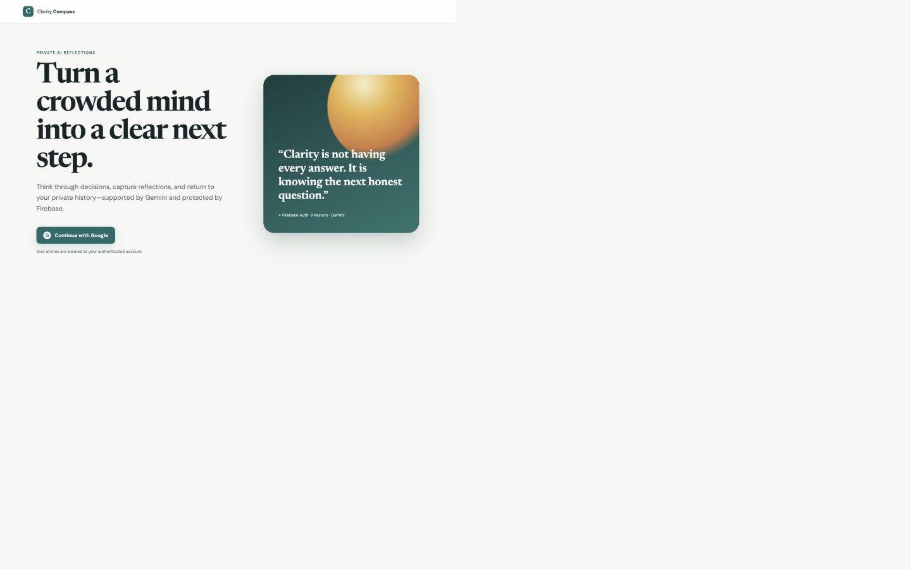

# Clarity Compass demo walkthrough

Clarity Compass turns an overloaded thought into a structured next step while
keeping every saved exchange isolated to its authenticated owner.

**Live app:** https://clarity-compass-journal-412542191970.asia-south1.run.app/

## User journey

1. Continue with Google through Firebase Authentication.
2. Choose Clarity, Decision, or Wellbeing mode.
3. Share a situation. The Cloud Run backend verifies the Firebase ID token,
   derives the owner path from its UID, loads only that owner's recent context,
   and calls Gemini with the selected reflection mode.
4. Return later to the private Firestore-backed history or permanently clear all
   saved reflections from the account.

## Why the architecture matters

The browser receives only Firebase's public web configuration. The restricted
Gemini API key remains in Google Cloud Secret Manager and is injected into a
dedicated Cloud Run service account. Private APIs verify Firebase ID tokens on
the server. Firestore writes use only
`users/{verified_uid}/interactions/{document}`; the backend never accepts a UID
from request data. Firestore rules independently enforce the same owner boundary
and deny every other document path.

Model output is rendered with `textContent`, private API responses are marked
`no-store`, prompts are length-limited, incomplete model calls are never saved,
and each request has a correlation ID without prompt content in logs.

## Evidence, not just a demo

- 26 API, security, isolation, failure and release-contract tests.
- 5 executable Firebase Emulator authorization suites.
- 94% application/evaluator statement coverage.
- 10 isolated deployed-model quality and safety cases at 100/100.
- Live two-account test proving each account saw only its own marker.
- Public desktop/mobile QA with no overflow or browser errors.
- Production Docker build and all gates independently reproduced by GitHub
  Actions.

The live evaluation explicitly covers prompt injection, privacy requests,
non-clinical boundaries, anti-dependency behavior, urgent safety, uncertainty,
trade-offs and reversible action. Synthetic accounts and Firestore documents are
deleted after each test run.

## Public evidence

- [Source repository](https://github.com/gowtham66867/clarity-compass-journal)
- [Live evaluation report](LIVE_EVALUATION.md)
- [Detailed test plan](TEST_PLAN.md)
- [Evidence-based engineering score](EVALUATION_REPORT.md)
- [Browser QA](BROWSER_QA.md)

Built for the Cloud Run Build & Deploy Social Challenge.

`#AccelerateAIwithCloudRun` `#GeminiAPI` `#Firebase` `#Firestore` `#GoogleCloud`
